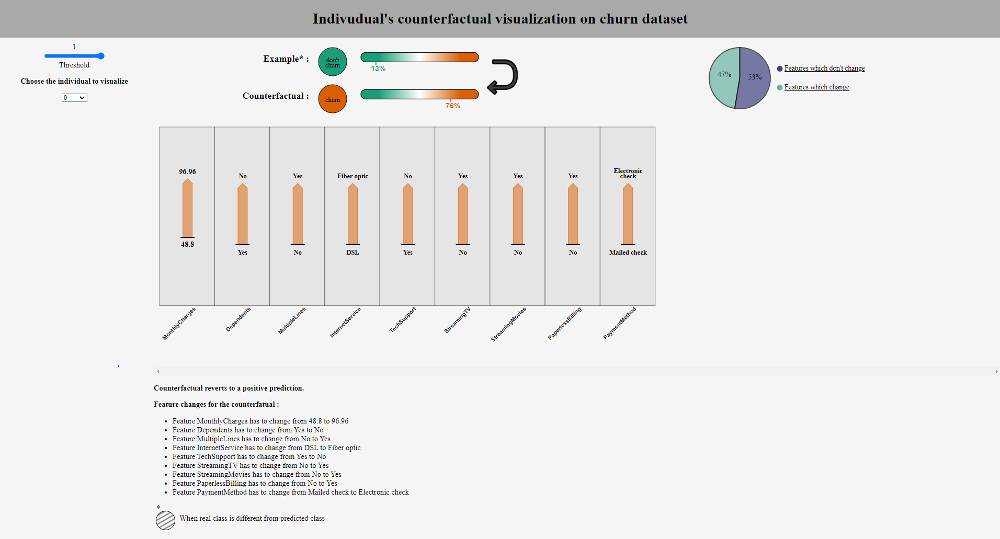

# Counterfactual visualization 

## Start

```
pip install -r requirements.txt
```

## Run server 

```
python app.py
```

## To change example datasets : 

input :  data_churn_probs.json in DATASET_PATH constant in $app.py$

## Example of interface :

